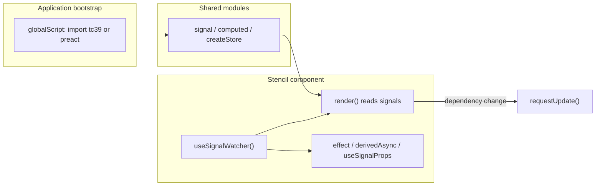

# @ssv/stencil-signals

> Signals-based reactive state for [StencilJS](https://stenciljs.com/) — auto-tracking `render()`, lifecycle-bound effects, and Stencil-native prop/event bridges. Ships with a **TC39** backend (`signal-polyfill`) and a **Preact Signals** backend (`@preact/signals-core`).

Part of the [stenciljs](https://github.com/sketch7/stenciljs) monorepo. Designed for design-system and product teams that want fine-grained reactivity without `@State()` mirroring or manual store sync.

## When to adopt

**Good fit**

- Shared UI state across many Stencil components (design tokens, shell chrome, feature flags).
- Derived values that should not be recomputed on every `render()` pass.
- Replacing `@Watch` + lifecycle boilerplate for prop-driven side effects.
- Async data in components with abort-on-change semantics (`derivedAsync`).
- Teams standardising on TC39 Signals or already using Preact Signals elsewhere.

**Adoption checklist**

1. Add peers: `@ssv/stencil-signals`, `@ssv/stencil.core`, one signal backend, `@stencil/core` (4.43+ recommended for passive listener parity in `signalFromEvent`).
2. Register **one** adapter in `globalScript` before any component code runs ([Installation](#installation)).
3. Standardise on `SsvElement` + `useSignalWatcher()` (or `SignalWatcherMixin` when composing mixins).
4. Document field order: `useSignalWatcher()` before `effect`, `derivedAsync`, `useSignalProps`, `signalFromEvent`.
5. Place module-level `signal()` / `createStore()` in `*.store.ts` files; keep components thin.
6. Align SSR: use `derivedAsync` + `initialValue` / transfer-state for hydrate apps ([SSR](#ssr-and-hydration)).

## Architecture

Signals live **outside** the component class. `SignalWatcherController` wraps `render()` in a persistent computed graph so any `signal()` read during JSX is tracked. When a dependency changes, a microtask-scheduled `requestUpdate()` runs.

Host-bound utilities (`effect`, `derivedAsync`, `useSignalProps`, `signalFromEvent`) register with an **active owner** opened in `hostConnected` and disposed in `hostDisconnected`, so reconnects and DOM moves do not leak listeners.



**Dependency:** [`@ssv/stencil.core`](../stencil.core/README.md) provides `SsvElement`, `use()`, and `ReactiveControllerHost` — the same foundation used by TanStack bindings and context APIs.

## Installation

```bash
pnpm add @ssv/stencil-signals @ssv/stencil.core
```

Choose **one** signal backend (peer dependency):

```bash
# TC39 (recommended for standards alignment)
pnpm add signal-polyfill

# Preact Signals (if the org already standardises on @preact/signals-core)
pnpm add @preact/signals-core
```

**Peers:** `@stencil/core >=4` (4.43+ recommended), `@ssv/stencil.core`, and exactly one of `signal-polyfill` or `@preact/signals-core`.

Activate the adapter once in a [global script](https://stenciljs.com/docs/config#globalscript) **before** components load:

```ts
// src/global.ts
import "@ssv/stencil-signals/tc39"; // or "@ssv/stencil-signals/preact"

export default function globalScript() {}
```

```ts
// stencil.config.ts
export const config: Config = {
  globalScript: "src/global.ts",
};
```

> [!IMPORTANT]
> Pick one adapter per application. Mixing `/tc39` and `/preact` in the same bundle is unsupported.

## Package layout and imports

| Import path                       | Activates adapter? | Typical use                                                                                       |
| --------------------------------- | ------------------ | ------------------------------------------------------------------------------------------------- |
| `@ssv/stencil-signals/tc39`       | Yes (TC39)         | `globalScript` only                                                                               |
| `@ssv/stencil-signals/preact`     | Yes (Preact)       | `globalScript` only                                                                               |
| `@ssv/stencil-signals`            | No                 | Primitives, `useSignalWatcher`, `effect`, `derivedAsync`, `createStore`, mixins                   |
| `@ssv/stencil-signals/extensions` | No                 | `useSignalProps`, `signalFromEvent` (also re-exported from adapter entries for `signalFromEvent`) |

The main entry does **not** configure an adapter. Using `signal()` without a prior `globalScript` import throws at runtime.

## Quick start

**Shared state** (module scope):

```ts
// counter.store.ts
import { computed, signal } from "@ssv/stencil-signals";

export const count = signal(0);
export const doubled = computed(() => count() * 2);
```

**Component**:

```tsx
import { Component } from "@stencil/core";
import { useSignalWatcher } from "@ssv/stencil-signals";
import { SsvElement } from "@ssv/stencil.core";
import { count, doubled } from "./counter.store";

@Component({ tag: "my-counter", shadow: true })
export class MyCounter extends SsvElement {
  readonly signalWatcher = useSignalWatcher();

  render() {
    return (
      <div>
        <p>
          {count()} — doubled: {doubled()}
        </p>
        <button type="button" onClick={() => count.update(n => n + 1)}>
          +1
        </button>
      </div>
    );
  }
}
```

## Integration patterns

| Pattern                                         | When to use                          | Notes                                                                        |
| ----------------------------------------------- | ------------------------------------ | ---------------------------------------------------------------------------- |
| `SsvElement` + `useSignalWatcher()`             | Default for new components           | No mixin ordering issues; works with `use()` hooks from `@ssv/stencil.core`  |
| `Mixin(SignalWatcherMixin, SsvElementMixin, …)` | Legacy bases or multiple mixins      | Put `SignalWatcherMixin` **first** in `Mixin()`                              |
| Module-level `signal()` / `createStore()`       | Cross-component shared state         | Import store modules; avoid storing signals on `this` unless instance-scoped |
| `useSignalProps`                                | Prop-driven logic without `@Watch`   | Import from `/extensions`; requires watcher first                            |
| `effect` / `derivedAsync` as class fields       | Side effects and async derived state | Declare **after** `useSignalWatcher()`                                       |

See [docs/signal-watcher.md](docs/signal-watcher.md) for mixin vs composition detail.

## Day-to-day patterns

### Field declaration order

On any component using host-bound utilities:

```tsx
readonly signalWatcher = useSignalWatcher(); // 1 — always first

readonly $props = useSignalProps(MyComp)({ ... }); // 2
readonly _sync = effect([...], ...); // 2
readonly user = derivedAsync(...); // 2
readonly $ev = signalFromEvent("scroll", { target: "window" }); // 2
```

`computedPrevious` and module-level `computed()` do not require the watcher.

### Writable props and framework output targets

Two-way prop signals emit `${propName}Change`. Declare the matching `@Event()` for React/Vue/Angular codegen:

```tsx
@Prop({ reflect: true }) isRunning = false;
@Event() isRunningChange!: EventEmitter<boolean>;

readonly $props = useSignalProps(AppTimer)({
  isRunning: { twoWay: true },
});
```

### Untracked reads

```ts
import { computed, signal, untracked } from "@ssv/stencil-signals";

const a = signal(0);
const b = signal(100);
const sum = computed(() => a() + untracked(() => b()));
```

Prefer `sig.peek()` for a single read; use `untracked(() => …)` for multiple reads in one expression.

### Reactive store

```ts
import { computed } from "@ssv/stencil-signals";
import { createStore } from "@ssv/stencil-signals"; // or "/extensions"

export const todoStore = createStore({ todos: [] as Todo[], nextId: 1 }, s => ({
  completedCount: computed(() => s.todos().filter(t => t.completed).length),
}));
```

Read with invocation (`store.count()`, `store.completedCount()`). Mutate with `set`/`update` (`store.count.set(1)`, `store.count.update(v => v + 1)`) or assignment (`store.count = 1`). Escape hatches: `$signal(key)`, `$reset()`.

## Migration from `@stencil/store`

Examples in this monorepo compare the legacy store pattern with signals ([counter](../../apps/stencil-playground/src/examples/stencil-signals/counter/), [todo](../../apps/stencil-playground/src/examples/stencil-signals/todo/)).

| Pain point                  | `@stencil/store`                | `@ssv/stencil-signals`                                     |
| --------------------------- | ------------------------------- | ---------------------------------------------------------- |
| Re-render after store write | Mirror into `@State()` manually | Read store/signals in `render()` with `useSignalWatcher()` |
| Derived values              | Recompute every render          | `computed()` — lazy, cached                                |
| Prop side effects           | `@Watch` + lifecycle hooks      | `effect([...], …)` or `useSignalProps`                     |
| Cross-tree reads            | Subscriptions or prop drilling  | Import shared module-level signals                         |

Incremental migration is supported: new features can use signals while existing screens keep `@stencil/store` until refactored.

## Features

| Utility                                   | Guide                                                                        |
| ----------------------------------------- | ---------------------------------------------------------------------------- |
| `useSignalWatcher` / `SignalWatcherMixin` | [signal-watcher.md](docs/signal-watcher.md)                                  |
| `useSignalProps`                          | [signal-props.md](docs/signal-props.md)                                      |
| `effect`                                  | [effect.md](docs/effect.md)                                                  |
| `derivedAsync`                            | [derived-async.md](docs/derived-async.md)                                    |
| `signalFromEvent`                         | [signal-from-event.md](docs/signal-from-event.md)                            |
| `computedPrevious`                        | Below ([API](#api-reference))                                                |
| `createStore`                             | Below ([API](#api-reference))                                                |
| `scheduler`                               | Microtask batching for `requestUpdate` (internal; exported for advanced use) |

**Dual backend:** same API surface; swap adapter by changing the `globalScript` import only.

## Examples in this repo

| Example                             | Stencil source                                                                                        | Vike SSR page                                                                                   |
| ----------------------------------- | ----------------------------------------------------------------------------------------------------- | ----------------------------------------------------------------------------------------------- |
| Counter                             | [`counter/`](../../apps/stencil-playground/src/examples/stencil-signals/counter/)                     | [`+Page.tsx`](../../apps/vike-playground/src/pages/stencil-signals/counter/+Page.tsx)           |
| Todo + `createStore`                | [`todo/`](../../apps/stencil-playground/src/examples/stencil-signals/todo/)                           | [`+Page.tsx`](../../apps/vike-playground/src/pages/stencil-signals/todo/+Page.tsx)              |
| Timer + `useSignalProps` + `effect` | [`timer/`](../../apps/stencil-playground/src/examples/stencil-signals/timer/)                         | —                                                                                               |
| `derivedAsync`                      | [`derived-async/`](../../apps/stencil-playground/src/examples/stencil-signals/derived-async/)         | [`+Page.tsx`](../../apps/vike-playground/src/pages/stencil-signals/derived-async/+Page.tsx)     |
| `computedPrevious`                  | [`computed-previous/`](../../apps/stencil-playground/src/examples/stencil-signals/computed-previous/) | [`+Page.tsx`](../../apps/vike-playground/src/pages/stencil-signals/computed-previous/+Page.tsx) |
| `signalFromEvent`                   | [`mouse-event/`](../../apps/stencil-playground/src/examples/stencil-signals/mouse-event/)             | [`+Page.tsx`](../../apps/vike-playground/src/pages/stencil-signals/mouse-event/+Page.tsx)       |

Run the dev stack from the repo root: `pnpm dev` (Stencil watch + Vike on port 3100).

## API reference

### Primitives

| Export                    | Description                                                  |
| ------------------------- | ------------------------------------------------------------ |
| `signal(value, options?)` | Writable signal; optional `equals`                           |
| `computed(fn, options?)`  | Read-only derived signal                                     |
| `batch(fn)`               | Coalesce writes (Preact delegates; TC39 relies on scheduler) |
| `untracked(fn)`           | Run without subscribing to inner reads                       |
| `scheduler`               | Backend-agnostic microtask queue used by the render watcher  |

`Signal<T>`: `()`, `.get()`, `.peek()`.
`WritableSignal<T>`: `.set()`, `.update()`, `.asReadonly()`.

### Component integration

| Export                     | Description                                                                                 |
| -------------------------- | ------------------------------------------------------------------------------------------- |
| `useSignalWatcher()`       | Class-field initializer; installs `SignalWatcherController` via `@ssv/stencil.core` `use()` |
| `SignalWatcherMixin(Base)` | Mixin factory; calls `useSignalWatcher()` in constructor                                    |
| `SignalWatcherController`  | Low-level controller (usually via `useSignalWatcher`)                                       |

### Extensions (`@ssv/stencil-signals/extensions`)

| Export                            | Description                                                            |
| --------------------------------- | ---------------------------------------------------------------------- |
| `useSignalProps(Host)(config)`    | `@Prop` → signal bridge; `transform`, `twoWay`, `default`, `required`  |
| `signalFromEvent(name, options?)` | DOM/window events as signals; Stencil `ListenOptions` + optional `map` |

Also exported from main entry: `effect`, `derivedAsync`, `computedPrevious`, `createStore`.

### Effects and async

| Export                            | Description                                                                     |
| --------------------------------- | ------------------------------------------------------------------------------- |
| `effect(fn)`                      | Auto-tracking; standalone runs immediately, class field runs on `hostConnected` |
| `effect(deps, fn, { defer? })`    | Explicit dependencies; `defer: true` skips initial run                          |
| `derivedAsync(fn, options?)`      | `DisposableSignal` + `whenSettled`; abort prior fetch on dep change             |
| `computedPrevious(source, init?)` | Previous value of a signal                                                      |

### Store

| Export                                | Description                             |
| ------------------------------------- | --------------------------------------- |
| `createStore(init, computedFactory?)` | Proxy store; `$signal(key)`, `$reset()` |

### Low-level

| Export                  | Description                                               |
| ----------------------- | --------------------------------------------------------- |
| `createWatcher(notify)` | Manual watch/unwatch/dispose                              |
| `collectSignals(fn)`    | Debug helper (dependency introspection varies by backend) |

## Development

From the monorepo root:

```bash
pnpm nx run stencil-signals:build
pnpm nx run stencil-signals:test
pnpm nx run stencil-signals:lint
pnpm nx run stencil-signals:fmt
```

Or from `libs/stencil-signals/`: `pnpm build`, `pnpm test`, `pnpm lint`, `pnpm fmt`.
