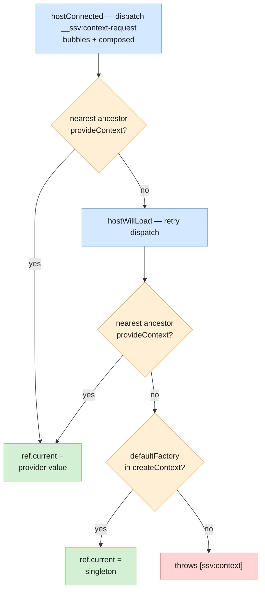
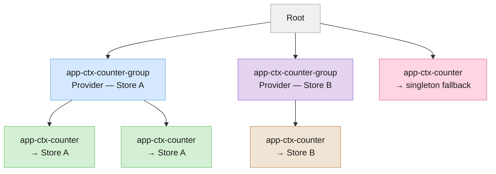

# Context

Tree-scoped dependency injection via DOM events. A consumer dispatches a `__ssv:context-request` event that bubbles up the DOM; the nearest ancestor `provideContext()` intercepts and responds. No provider → singleton fallback from `createContext`'s `defaultFactory`. SSR→client hydration (bottom-up init) is handled transparently.

## API

| Export           | Kind | Purpose                                                               |
| ---------------- | ---- | --------------------------------------------------------------------- |
| `createContext`  | fn   | Creates a typed `ContextKey` token with an optional default           |
| `provideContext` | fn   | Registers the host as a provider; returns the context value           |
| `useContext`     | fn   | Consumes the nearest ancestor provider; returns a `ContextRef`        |
| `ContextKey<T>`  | type | Opaque token that pairs a provider with its consumers                 |
| `ContextRef<T>`  | type | Stable ref: `.current` holds the resolved value before the first render |

## Resolution



`hostWillLoad` is a safety net for SSR bottom-up hydration — when the provider connects after the consumer, the retry finds it. Missing-provider errors surface as a rejected `componentWillLoad` (not a crash in `connectedCallback`).

## Define a context

```ts
// counter.context.ts
import { createContext } from "@ssv/stencil.core";

export const CounterContext = createContext<CounterStore>(
  () => createCounterStore(),
  { name: "counter" },
);
```

`defaultFactory` is called at most once — result cached as a singleton for consumers without a provider.

## Provide

```ts
@Component({ tag: "app-ctx-counter-group", shadow: true })
export class AppCtxCounterGroup extends SsvElement {
  readonly store = provideContext(CounterContext);

  render() {
    return <slot />;
  }
}
```

Each component calling `provideContext` gets a **fresh instance** (via `key.createInstance()`). Pass an explicit value or factory to override:

```ts
readonly store = provideContext(CounterContext, createCounterStore(10));
readonly store = provideContext(CounterContext, () => createCounterStore(10));
```

## Consume

```ts
@Component({ tag: "app-ctx-counter", shadow: true })
export class AppCtxCounter extends SsvElement {
  readonly #storeRef = useContext(CounterContext);

  render() {
    const { count } = this.#storeRef.current.state;
    return <span>{count}</span>;
  }
}
```

`.current` is always set by the time `render()` runs — resolution spans `hostConnected` through `hostWillLoad`, both before the first render.

## Compose into a hook

`useContext` composes naturally inside a factory hook — one call, fully typed, no boilerplate in the component:

```ts
// counter.hooks.ts
export function useCounter() {
  const storeRef = useContext(CounterContext);
  const getCount = useSelector(() => storeRef.current, s => s.count);

  return {
    get count() { return getCount() ?? 0; },
    increment: () => storeRef.current.actions.increment(),
    decrement: () => storeRef.current.actions.decrement(),
  };
}

// In the component:
readonly #c = useCounter();
```

## Component tree

Multiple independent providers create isolated scopes. Consumers outside any provider fall back to the singleton.



Full working example: [context/counter](../../apps/stencil-playground/src/examples/context/counter/).
